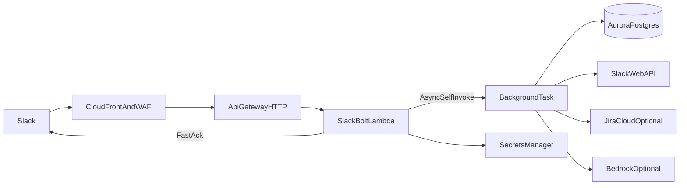

# Slack Feedback Template

A reusable Slack app template for capturing structured product feedback, routing it to product owners, and optionally turning feedback into Jira tickets.

The template is designed for teams that want a production-ready starting point rather than a blank Slack bot. It includes Slack Bolt handlers, local Socket Mode development, AWS Lambda deployment, Aurora PostgreSQL persistence, optional Jira integration, optional Bedrock duplicate/routing assistance, and Pulumi infrastructure.

## What You Get

- `/logfeedback` opens a structured feedback modal in Slack.
- Feedback is posted back into the source channel with PM actions.
- PMs can respond, reroute, track status, and create Jira tickets.
- App Home gives each PM a triage queue.
- Aurora stores feedback records and Slack view-submission idempotency claims.
- Lambda uses a background self-invoke path so Slack interactions can ack quickly.
- Tenant-specific data lives in local/example config files, not in the public template.

## Architecture

| Layer | Default choice |
| --- | --- |
| Slack runtime | `@slack/bolt` with `AwsLambdaReceiver` in production and Socket Mode locally |
| Compute | AWS Lambda, Node.js 22 |
| Storage | Aurora Serverless v2 PostgreSQL with IAM auth |
| Secrets | AWS Secrets Manager under a configurable prefix |
| AI assist | Optional AWS Bedrock model calls for duplicate ranking and routing nudges |
| Jira | Optional Jira Cloud REST API integration |
| Edge | API Gateway HTTP API, CloudFront, and WAF |
| Infrastructure | Pulumi Python with `uv` |
| CI/CD | GitHub Actions for build plus Pulumi preview/up |



## Public Template Safety

This repo intentionally does not include real customer names, Slack channel IDs, PM user IDs, Jira custom field IDs, Jira team UUIDs, AWS account IDs, or live stack config.

Use the files in `examples/` as starting points and copy private values into gitignored local files:

- `examples/channel-config.example.js` -> `app/src/channel-config.local.js`
- `examples/jira-project-config.example.js` -> `app/src/jira-project-config.local.js`
- `examples/Pulumi.stack.example.yaml` -> `Pulumi.<stack>.yaml`
- `app/src/accounts.example.csv` -> `app/src/accounts.csv` if you want a private customer typeahead list

## Quick Start: Local Development

1. Install Node.js 22 and Python 3.12.
2. Install app dependencies:

   ```bash
   cd app
   npm ci
   ```

3. Create `.env` from `.env.example` and fill in your Slack Socket Mode tokens.
4. Configure Slack channels by copying `examples/channel-config.example.js` to `app/src/channel-config.local.js`.
5. Start local Socket Mode:

   ```bash
   npm run dev
   ```

Local development uses the in-memory store unless Lambda environment variables for Aurora are present.

## Slack Setup

Create a Slack app with Socket Mode enabled for local development and interactivity enabled for production. See `docs/SLACK_APP_MANIFEST.yaml` for a starter manifest.

Important values to configure:

- Slash command: `/logfeedback` by default, or set `SLACK_FEEDBACK_COMMAND`.
- Bot display name: set in Slack and optionally mirror with `SLACK_BOT_DISPLAY_NAME`.
- Interactivity URL: your deployed CloudFront URL.
- Event/request URL: your deployed CloudFront URL if you enable events.
- Required local env vars: `SLACK_BOT_TOKEN`, `SLACK_SIGNING_SECRET`, `SLACK_APP_TOKEN`.

## Configure Product Areas

Channel routing lives in `app/src/channel-config.local.js`. Each Slack channel can define a product area, a PM user ID, custom modal fields, and optional Jira search scope.

```javascript
const channelConfig = {
  C0XXXXXXXXX: {
    name: "Core Product",
    description: "Feedback about the primary product workflow.",
    pmUserId: "U0XXXXXXXXX",
    pmName: "Alex Product",
    customFields: [],
    jiraSearch: { projectKeys: ["PROD"] },
  },
};

module.exports = { channelConfig };
```

If a channel is not configured, the app uses a generic fallback area.

## Optional Jira Integration

Jira ticket creation is enabled when these secrets are present locally or in AWS Secrets Manager:

- `JIRA_BASE_URL`, for example `https://your-org.atlassian.net`
- `JIRA_USER_EMAIL`
- `JIRA_API_TOKEN`

Some Jira workflows require custom fields that are not discoverable through `createmeta`. Use the scripts in `app/scripts/` to inspect your instance, then copy `examples/jira-project-config.example.js` to `app/src/jira-project-config.local.js` and fill in your project-specific values.

Tickets created through the app receive labels based on `JIRA_LABEL_PREFIX`, which defaults to `slack-feedback`.

## Optional Customer Typeahead

The template includes `app/src/accounts.example.csv` with synthetic data. To use real customer names, create a private `app/src/accounts.csv` with a `name` header. That file is gitignored.

You can also point to another private CSV with `ACCOUNTS_CSV_PATH`.

## Deployment

1. Build the Lambda bundle:

   ```bash
   cd app
   npm ci
   npm run build
   ```

2. Install infrastructure dependencies:

   ```bash
   uv sync
   ```

3. Create a Pulumi stack and config:

   ```bash
   pulumi stack init dev
   cp examples/Pulumi.stack.example.yaml Pulumi.dev.yaml
   ```

4. Put production secrets in AWS Secrets Manager under your configured `secretPrefix`.
5. Run a preview and deploy:

   ```bash
   pulumi preview
   pulumi up
   ```

The GitHub Actions workflows are disabled unless you set repository variables for `PULUMI_STACK_NAME` and `AWS_ROLE_TO_ASSUME`. Set `AWS_REGION` if you are not using `us-east-1`, and set `PULUMI_ACCESS_TOKEN` as a secret when using Pulumi Cloud.

## Slack Ack Constraint

Slack interaction handlers have a 3-second ack deadline. In Lambda with `AwsLambdaReceiver`, the HTTP response is sent only after the handler resolves, so every awaited operation counts. Keep foreground work small and put heavier work such as database writes, Slack Web API calls, Jira, and Bedrock in the background self-invoke path.

## Verification

Useful checks before publishing or deploying a fork:

```bash
cd app && npm ci && npm run build
uv sync
rg "<old-company>|<old-internal-org>|<old-project-name>|<old-label-prefix>|<aws-account-id>" .
```

The template currently provides build verification rather than a full test suite. Add app-specific tests once you customize routing, Jira behavior, or database workflows.
